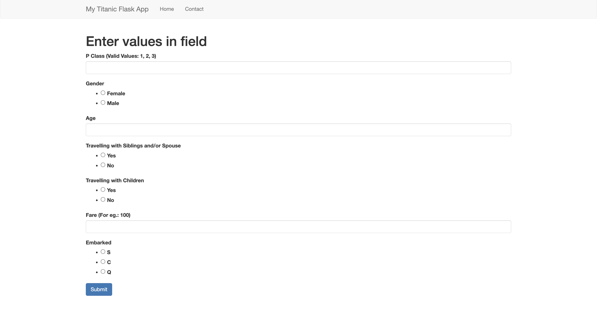
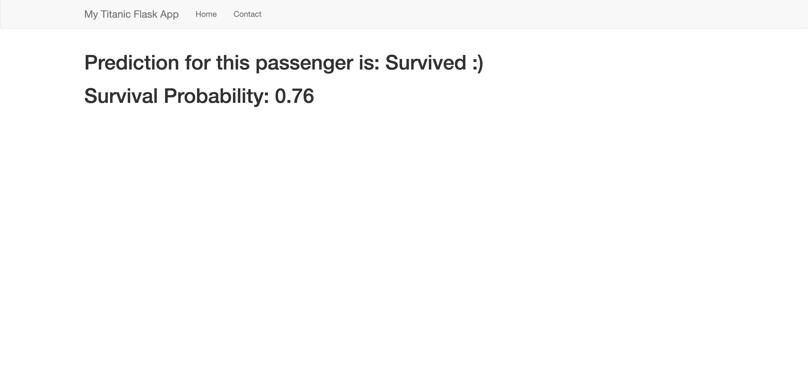

# 🚀 Embed ML models into a web app using Flask 🚀

There are many ways to make web interfaces to allow interaction with Machine Learning models and we will cover one of them.

## Description

You will have a minimal interface demo with [Flask](), this will just serve you to make sure that everything works correctly. Then, you will have to make your own interfaces, those allowing you to interact with a Machine Learning model, that is to say:
- Pass values through the interface;
- Recover these values in backend;
- Apply the necessary processing;
- Submit the previously processed values to the ML model to make the predictions;
- Process the predictions obtained and display them on the interface.

## Installation

You have two ways in order to setup and run this project.

### Manual Setup

For manual installation, you need to have [`Python3`](https://www.python.org/) on your system. Then you can clone this repo and being at the repo's `root :: ML_app_embeded_using_Flask> ...`  follow the steps below:

- Create a virtual environment with the command :
        
        python3 -m venv venv

- Activate the virtual environment with the command :
  
  Windows:

      venv/bin/activate 
  
  Linux & Mac: 

      source venv/bin/activate

- Install the necessary dependencies with the command :
        
      python -m pip install --upgrade pip; python -m pip install -r requirements.txt

- Run the Flask app :
  - Go to your browser at the following address :
        
      http://127.0.0.1:5000
        
  - Endpoints:
    
    - Demo

          http://127.0.0.1:5000/example

    - Titanic survival prediction

          http://127.0.0.1:5000/titanic

## Structure
### File: app.py
This file must contain the Flask app. You will define the page endpoints, the logic that will be executed on each page of the Flask app and the html template to use for each endpoint.

### File: utils.py
This file must contain the functions or/and classes you have written to do preprocessing, feature engineering, post-processing, etc. You must copy and paste it into the file and import in functions and classes into the file `app.py` to use it to allow your ml models to work correctly.

### Folder: ml
This folder must contain your ml models objects saved as files, also your transformation pipelines objects saved as files.

### Folder: templates
This folder must contain the web page templates, the html files. You will define the appearance of the parts of your Flask app using web technologies `(HTML & CSS, WTForms, ...)`.

### Folder: statics
This folder must contain the static files your templates will loads, like images, templates' CSS,Js, etc.

## Screenshots
### Titanic App Intefaces
<table>
    <tr>
        <th>Input Page</th>
        <th>Prediction Page</th>
    </tr>
    <tr>
        <td></td>
        <td></td>
    </tr>
</table>

## Resources
Here are some ressources you would explore to have a good understanding of Flask :
- [Getting started with Flask](https://dev.to/nagatodev/getting-started-with-flask-1kn1)
- [Video: Flask tutorial](https://www.youtube.com/watch?v=Kja_28SNIow)
- [Handling Forms in Flask with Flask-WTF](https://hackersandslackers.com/flask-wtforms-forms/)
- [Handling forms in Flask with Flask-WTForms, Published On March 1, 2022](https://www.analyticsvidhya.com/blog/2022/03/handling-forms-in-flask-with-flask-wtforms/)
- [Intro to Flask-WTF (Part 1 of 5)](https://www.youtube.com/watch?v=vzaXBm-ZVOQ&list=PLdXrUau65MnMlMGISqq3QmCY8hHoe84jf)
<!-- -  -->

## Contributing

Feel free to make a PR or report an issue 😃.

Oh, one more thing, please do not forget to put a description when you make your PR 🙂.

## Author

- [Emmanuel KOUPOH](https://www.linkedin.com/in/esa%C3%AFe-alain-emmanuel-dina-koupoh-7b974a17a/)
